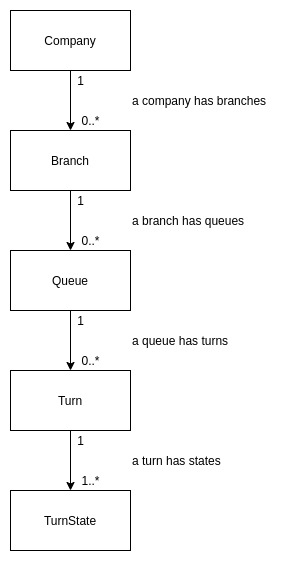
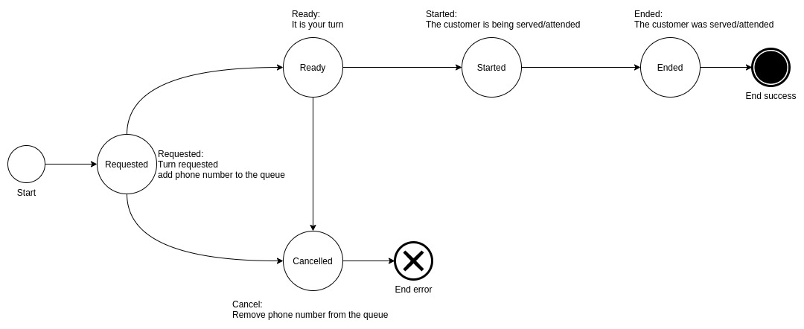

# Noq

Let your phone make the queue for you.

## Description

Imagine the following scenario:

You are in a mall and want to go to your bank's branch that is located in that mall. Instead of making a line and stand
still until you are attended by the bank clerk, you type your phone number into a tablet by the entrance of the branch
and then leave.

Now you are able to walk around and even buy a few things while you "wait"
for a text message. Twenty minutes have passed since you left the branch, when you get a text message telling you to
please go back to the bank because you are the next turn.

Five minutes later, you arrive at the bank's branch, and your number gets called almost immediately.

## Why?

During the Covid19 pandemic I was living in a country in Latin America. One day I had to go to a branch of one of the
biggest banks in that country. The branch was located in a nice mall in the city.

I arrived 10 minutes before the branch opened to avoid a large queue. Unfortunately I was not the only one who thought
about doing that, and ended up having to make a line both outside and inside the branch.

As you can imagine this was very risky because of Covid19. However, that was not the only reason. Standing still in a line is
both boring and not time efficient. That's why I decided to create this piece of software.

## Spec

### Entities

Noq has 5 main entities:

1. Company: has many branches
1. Branch: has many queues
1. Queue: has many turns
1. Turn: represents a customer in a queue
1. TurnState: represents a state of a turn

### API

You can find the full API spec [here](docs/api_spec.json) in Open API format.

Additionally, when you start the system you can interact with the API documentation
using Swagger UI here: http://locahost:8000/swagger-ui.html

The system provides an API that you can use to:

#### Company

1. Create a company

#### Branch

1. Create a branch of a company

#### Queue

1. Create a queue in a branch

#### Turn

1. Request a turn in a queue given a phone number
1. Call the next turn in a queue
1. Cancel a turn
1. Mark turn as started
1. Mark turn as ended

The five Turn endpoints of the Turn entity are used to move the turn in the following state machine:

