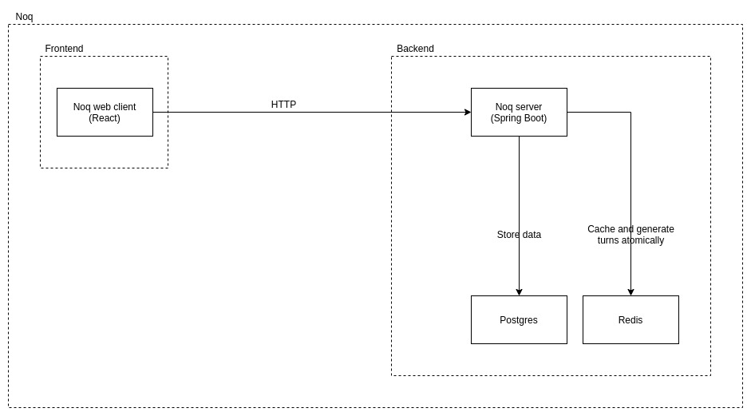

# Noq

Let your phone make the queue for you.

## Description

Imagine the following scenario:

You are in a mall and want to go to your bank's branch that is located in that mall.
Instead of making a line and stand still until you are attended by the bank clerk,
you type your phone number into a tablet by the entrance of the branch and then
leave.

Now you are able to walk around and even buy a few things while you "wait" for a
text message. Twenty minutes have passed since you left the branch, when you get
a text message telling you to please go back to the bank because you are the next
turn.

Five minutes later, you arrive at the bank's branch, and your number gets called
almost immediately.

## Why?

During the Covid19 pandemic I was living in a country in Latin America. One day
I had to go to a branch of one of the biggest banks in that country. The branch
was located in a mall.

When I arrived at the branch I had to make a line both outside and inside of it.
As you can imagine this was very risky because of Covid19. However, that was not
the only reason. Standing still in a line is both boring and not time efficient.
That's why I decided to create this piece of software.

## Software

Noq is divided in two main parts:

* [Frontend](frontend/): Responsive web UI made with React.
* [Backend](backend/): API made using Spring Boot, Postgres and Redis.

You can find the documentation of each of them clicking the links above ^.

