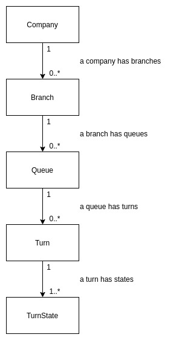
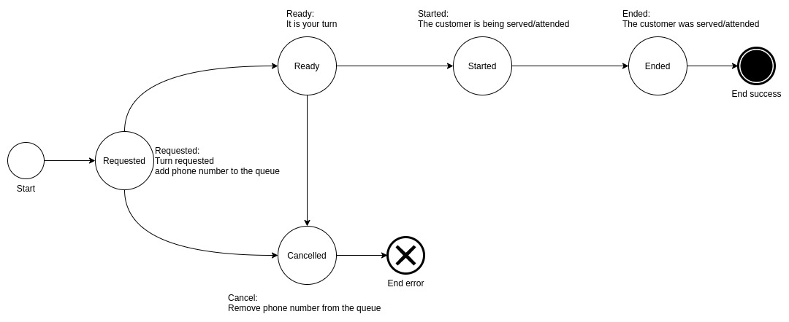

# Noq Backend

- [Noq Backend](#noq-backend)
  - [Entities](#entities)
  - [Features](#features)
    - [Company](#company)
    - [Branch](#branch)
    - [Queue](#queue)
    - [Turn](#turn)
      - [Turn states](#turn-states)
  - [API](#api)
  - [Tests](#tests)
  - [Run](#run)

---

This directory contains the backend code of Noq.

The backend is a Spring Boot application that exposes an API via HTTP and uses:
1. Postgres: to persist data.
2. Redis:
   1. To cache current turns.
   2. To generate turn sequences in a distributed environment.
       See: https://redis.io/commands/INCR

## Entities

The code is divided by entities, here are the main entities of the problem.

1. Company
   * A company has many branches.
   * Example: a bank.
2. Branch
   * A branch has many queues.
   * Example: the bank branch located on 33th St.
3. Queue
   * A queue has many turns.
   * Example: the payments queue in a bank branch.
4. Turn
   * A turn represents a customer in a queue.
   * Example: the turn P1 is the first turn of the payments queue.
5. TurnState
   * A turn state represents a state of a turn.
   * For example the current state of turn P1 is "requested".

## Features

These are the functionalities the system provides grouped by entity:

### Company

1. Create a company

### Branch

1. Create a branch of a company
2. Get the queues of a branch

### Queue

1. Create a queue in a branch

### Turn

1. Request a turn in a queue given a phone number
1. Call the next turn in a queue
1. Cancel a turn
1. Mark turn as started
1. Mark turn as ended

#### Turn states

The five Turn endpoints of the Turn entity are used to move the turn in the following state machine:

## API

You can find the full API spec [here](docs/api_spec.json) in Open API format.

Additionally, when you [run the system](#run) you can interact with the API
documentation using Swagger UI [here](http://localhost:8000/swagger-ui.html).

## Tests

In order to execute the tests of the backend please do the following:

1. Clone the repository
2. `cd noq/backend/`
3. `mvn clean test`

## Run

In order to run the backend, please do the following:

1. Clone the repository
2. `cd noq/backend/`
3. `docker-compose up -d`
4. `mvn clean package`
5. `java -jar target/noq-0.0.1-SNAPSHOT.jar`
