# Noq Frontend

- [Noq Frontend](#noq-frontend)
  - [Views](#views)
  - [Public views](#public-views)
    - [Login](#login)
  - [Admin views](#admin-views)
    - [Create company](#create-company)
    - [Create branch](#create-branch)
    - [Create queue](#create-queue)
  - [Manager views](#manager-views)
    - [Create branch](#create-branch-1)
    - [Create queue](#create-queue-1)
    - [Call next turn](#call-next-turn)
    - [Start turn](#start-turn)
    - [End turn](#end-turn)
  - [Agent views](#agent-views)
    - [Call next turn](#call-next-turn-1)
    - [Start turn](#start-turn-1)
    - [End turn](#end-turn-1)
  - [Customer views](#customer-views)
    - [Request turn](#request-turn)
    - [Turn confirmation](#turn-confirmation)
  - [Tests](#tests)
  - [Run](#run)

---

This directory contains the frontend code of Noq.

The frontend is a React application that consumes the backend API via HTTP and uses:
1. React router: to handle transitions between views.
2. Testing-library: for tests.

## Views

The frontend shows different views depending on the role of an authenticated user.

## Public views

The only public view is the login.

### Login

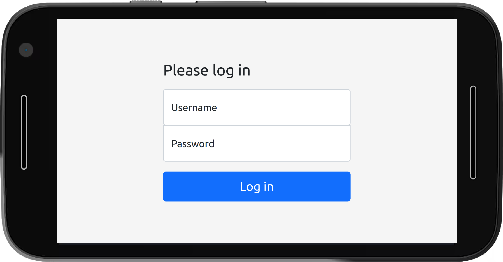

---

## Admin views

The administrator of the system can:

1. Create a company
2. Create a branch in a company
3. Create a queue in a branch

### Create company

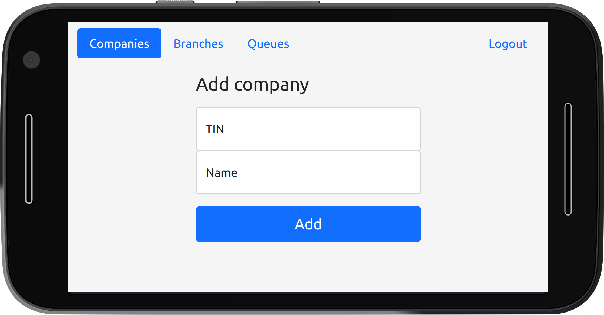

### Create branch

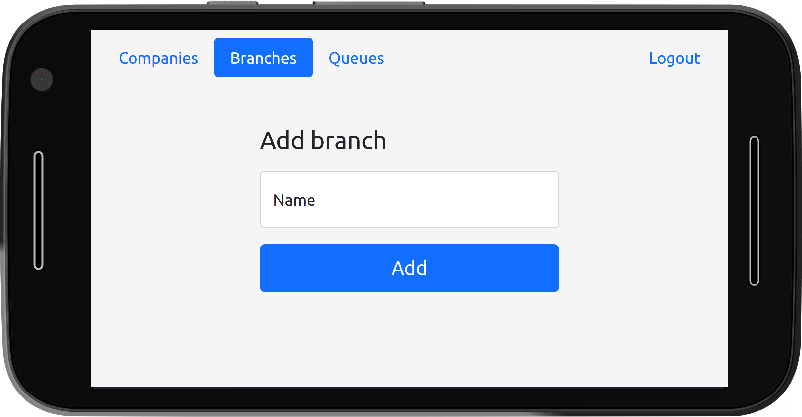

### Create queue

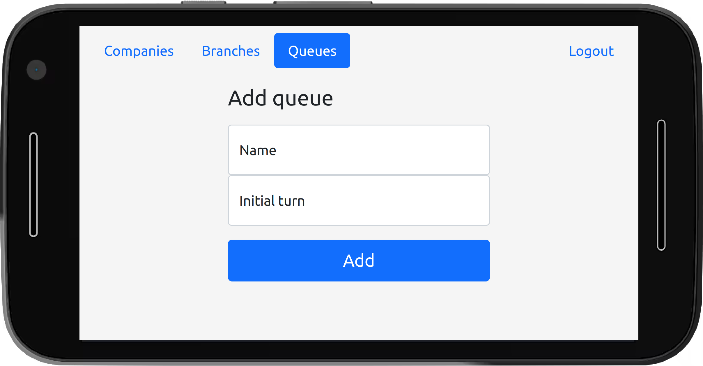

---

## Manager views

The manager of the company can:

1. Create a branch in a company
2. Create a queue in a branch
3. Call the next turn
4. Mark a turn as started
5. Mark a turn as ended

### Create branch

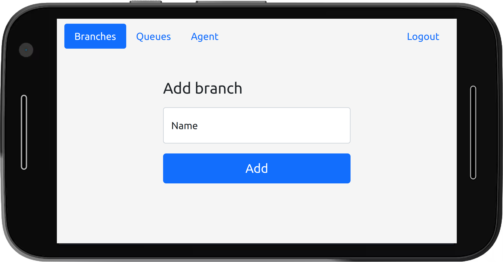

### Create queue

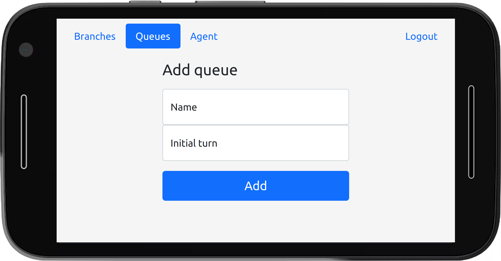

### Call next turn

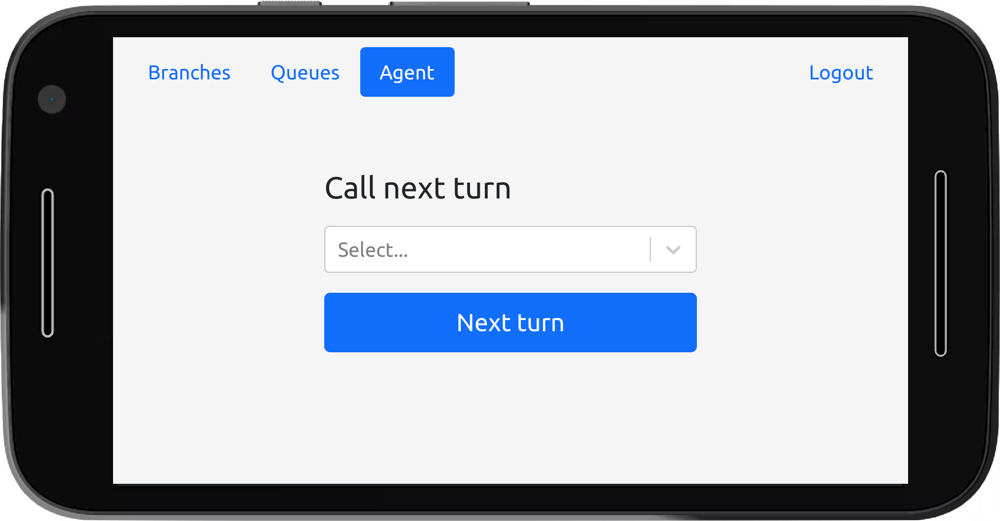

### Start turn

Mark the current turn as started, meaning that we are attending the customer.

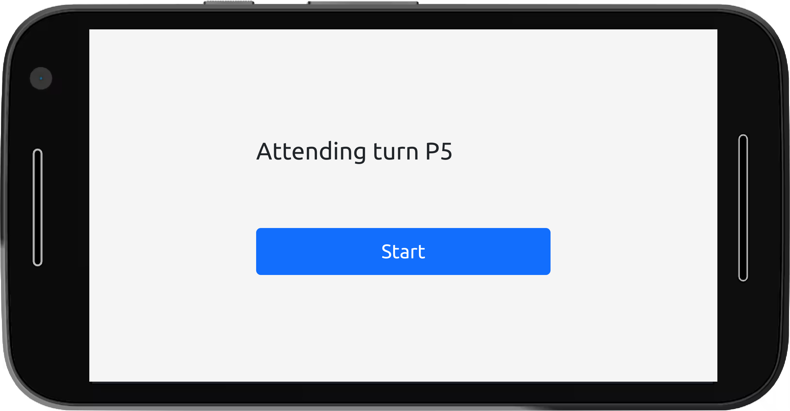

### End turn

Mark the current turn as ended, meaning that we are done attending the customer.

---

## Agent views

An agent is associated to a single branch and can do the following:

1. Call the next turn
2. Mark a turn as started
3. Mark a turn as ended

### Call next turn

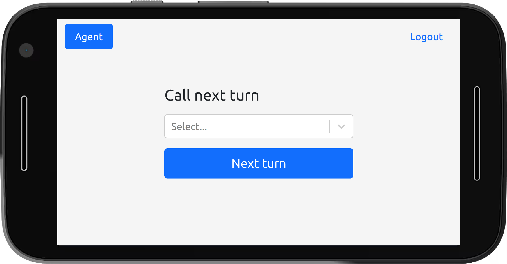

### Start turn

Mark the current turn as started, meaning that we are attending the customer.

### End turn

Mark the current turn as ended, meaning that we are done attending the customer.

---

## Customer views

A customer of a branch can:

1. Request a new turn
2. See the confirmation that a new turn was generated

**How do we know to which branch the user is requesting a new turn?**

Each branch should have a user with the role "customer".
Before the branch opens, an employee of the branch must authenticate (using the
credentials of the user with role "customer") in the device(s) that will be
used by the customers.

### Request turn

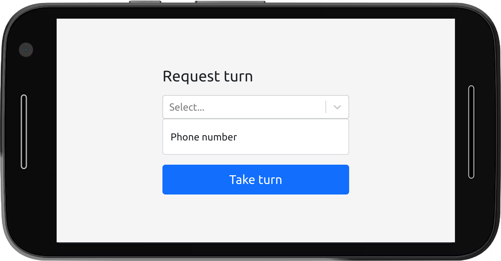

### Turn confirmation

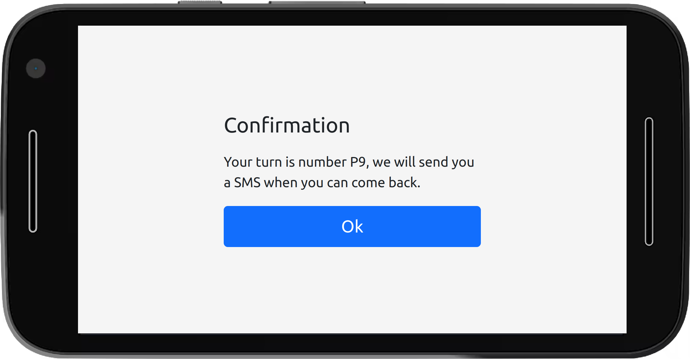

## Tests

In order to execute the frontend tests please do the following:

1. Clone the repository
2. `cd frontend/noq/`
3. `npm test`

## Run

In order to run the frontend, please do the following:

1. Clone the repository
2. `cd frontend/noq/`
3. `npm start`
